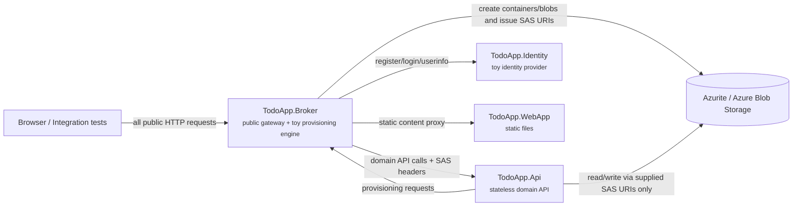

# ToDo App - Spec-First Demonstration

A demonstration ToDo application built with OpenAPI-first service contracts and Corvus.Json code generation. It shows how a back-end API can manage domain behavior without owning storage credentials: the browser talks to a broker, the broker supplies short-lived SAS URIs, and the API reads and writes Azure Blob Storage only through SAS tokens supplied in request headers.

This is a demo application, not production architecture. In particular, `TodoApp.Broker` intentionally combines front-end proxy, credential broker, provisioning engine, and session glue so the pattern is easy to run locally.

## Architecture



The browser never calls `TodoApp.Api` directly. The broker is the public origin for auth, static content, user/org operations, todo CRUD, and provisioning status checks.

## Projects

| Project | Role |
| --- | --- |
| `src\TodoApp.Api` | Stateless back-end API for todo CRUD, directory/user/org operations, and provisioning callbacks. |
| `src\TodoApp.Broker` | Toy public gateway and provisioning component. Owns storage credentials, injects SAS tokens, and reverse-proxies static content. |
| `src\TodoApp.Identity` | Toy identity service for demo registration/login and JWT issuing. |
| `src\TodoApp.WebApp` | Static HTML/CSS/JavaScript front end served through the broker. |
| `src\TodoApp.AppHost` | .NET Aspire orchestration for the services and Azurite. |
| `tests\TodoApp.IntegrationTests` | End-to-end tests using Aspire test hosting. |

## Specs and generated code

The specs in `specs\` are the source of truth for generated server/client surfaces.

| Spec | Purpose |
| --- | --- |
| `todo-api.json` | Back-end todo API and provisioning callback endpoint. |
| `directory-api.json` | Back-end directory API for users, organizations, memberships, and current-user profile data. |
| `directory-storage.json` | JSON Schema for the catalog blob model. |
| `identity-api.json` | Toy identity API. |
| `broker-frontend.json` | Public broker API for auth, gateway, and proxy endpoints. |
| `broker-runtime.json` | Broker runtime provisioning API called by the back-end API. |

Generated code is committed under each project's `Generated` folder. Regenerate it after spec changes:

```powershell
.\generate.ps1
.\generate.ps1 -Clean
```

`Corvus.Json.Cli` must be available on the path, for example via `dotnet tool install -g Corvus.Json.Cli`.

## User and organization flow

Users have one private todo list and one separate organization-user todo list for each organization to which they belong. Organization-user todos are not shared organization todos; they are the todos for a specific user in a specific organization.

The current sign-up flow is:

1. The browser calls `POST /auth/register` on the broker.
2. The broker calls the identity service, receives a JWT, and stores it in the demo auth cookie.
3. The browser calls `POST /api/users` on the broker.
4. The broker forwards the request to the API with `X-Identity-Subject` and a catalog SAS URI.
5. The API creates the Todo-domain user using the identity subject as the user id and asks the broker to provision personal todo storage.
6. The browser waits for the provisioning ticket, then reads `GET /api/me`.

Login and app startup are read-only: they call `GET /api/me` and do not auto-create Todo-domain users. There is intentionally no `/api/me/ensure` endpoint.

## Provisioning flow

Entity creation follows the same demo pattern:

1. The browser sends a create request to the broker, such as `POST /api/users`, `POST /api/organizations`, or `POST /api/organizations/{orgId}/members`.
2. The broker forwards the request to the API with the relevant SAS token headers.
3. The API writes domain/catalog state first.
4. The API calls the broker runtime provisioning API with a callback URL and the original payload.
5. The broker creates the demo blob container/blob, records provisioning status, generates a blob SAS URI, and calls the API callback.
6. The API initializes the provisioned blob with an empty todo list.

This separation is the key demo point: the API can initialize and use storage, but only through SAS URIs supplied by the broker.

## Storage layout

Container names are derived from identifiers with truncated SHA-256 hashes so arbitrary identity subjects and organization ids are safe for Azure container names.

| Data | Container | Blob |
| --- | --- | --- |
| Directory/catalog users, organizations, and memberships | `catalog` | `catalog.json` |
| Broker provisioning tickets | `registry` | `tickets/{ticket}.json` |
| Broker demo registry | `registry` | `registry.json` |
| Identity demo accounts | `identity` | `accounts.json` |
| User personal todos | `user-{hash(subject)}` | `todos.json` |
| Organization-user todos | `om-{hash(subject)}-{hash(orgId)}` | `todos.json` |
| Organization entity storage initialized by provisioning | `org-{hash(orgId)}` | `todos.json` |

User-facing organization todo operations use the organization-user storage row above.

## Running locally

Prerequisites:

- .NET 10 SDK
- Docker or another container runtime supported by Aspire for Azurite
- `Corvus.Json.Cli` if you need to regenerate code

Common commands:

```powershell
dotnet build .\todo-app.slnx
dotnet run --project .\src\TodoApp.AppHost\TodoApp.AppHost.csproj
dotnet test .\todo-app.slnx
```

The Aspire AppHost starts the API, broker, identity service, static web app, and Azurite.

## Testing

The integration tests cover the main user, organization, organization-member, provisioning, and todo CRUD workflows:

```powershell
dotnet test .\todo-app.slnx
```

## Demo caveats

- The broker is a toy. See `src\TodoApp.Broker\README.md` for the detailed warning.
- The identity service is a toy. It uses intentionally minimal demo authentication and account storage.
- The broker currently contains a few manual proxy endpoints alongside generated endpoints for UI convenience.
- The app is optimized to demonstrate spec-first generation, Corvus JSON models, SAS-token isolation, and async provisioning, not production security or operations.
